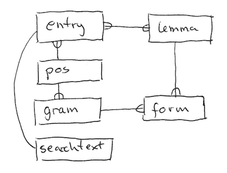
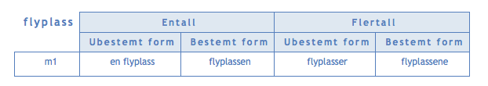

# Dictionary SQLite database format

This document describes the SQLite export format.  This is a database file
containing a collection of dictionary entries and supporting indexes and
tables.

The supporting tables should make it easy to locate articles by searching for
words in various forms.  The `lemma`, `form` and `searchtext` tables can be
deleted without loosing information, as this information can also
be obtained from the `entry.xjtei` structure.

## Database schema

### `entry`

This represents a single directory entry.  This is an article describing a
single "word".

Field|Type|Comment
-----|----|---------
`id` | int pk | Every entry has a numeric key
`lang` | enum('nb', 'nn') | Bokmål or Nynorsk [ISO 639-1 code](https://en.wikipedia.org/wiki/List_of_ISO_639-1_code)
`pos_id`| fk | What kind of word is this (verb, noun,...)
`tei` | xml null | The dictionary entry in TEI format
`xjtei` | json | The dictionary entry in [XJ-TEI format](xjtei.md)

### `lemma`

The base form of the word described by a dictionary entry.
Ref [wikipedia](https://en.wikipedia.org/wiki/Lemma_(morphology)).
A single article can have multiple lemmas, and the same `lemma.orth`
value can be used by other entries as well.

Field|Type|Comment
-----|----|---------
`id` | int pk | Each lemma has its own key
`orth`| varchar | The spelling of the word
`entry_id`|fk | The corresponding entry

### `pos`

POS stands for 'Part of Speech' and is the gramatical class that the
word belongs to; like verb, noun, adjective, etc.

Field|Type|Comment
-----|----|---------
`id` | enum('v', 'n',...) | The class of word (v=verb, n=noun,...)
`name`| varchar | 'Verb', 'Substantiv', 'Adjektiv',...
`lang`| enum('nb', 'nn') | The language of `name`

### `gram`

This expresses the gramatical forms that words of the referenced _pos_
takes.  For instance nouns in Norwegian has the following 4 forms:

* "Entall; Ubestemt form"
* "Entall; Bestemt form"
* "Flertall; Ubestemt form"
* "Flertall; Bestemt form"

Field|Type|Comment
-----|----|---------
`id` | id | Just something unique
`name`| varchar | String like "Entall; Ubestemt form"
`order`| int | The natural order for the given _pos_ and _lang_
`pos_id` | fk | The _pos_ this applies to
`lang` | enum('nb', 'nn') | The language of _name_

If `form.name` contains ";" it denotes an oportunity to join columns together
names with the same prefix.  For instance the 4 forms above can be presented
like this:

### `form`

This encodes the how a specific _lemma_ of a word is to be spelled in its
various gramatical forms.  There can be multiple systems that applies for a
single word which is expressed by the _paradim_ key.  A separate row will be
filled in for all variations of _gram_ given the word's _pos_.

Field|Type|Comment
-----|----|---------
`lemma_id` | fk | Combined key
`gram_id` | fk | Combined key
`paradigm` | int | Combined key
`orth` | varchar | text

### `searchtext`

This is contains the concatenation of the plain text found in a dictionary
entry.  It can be used to implement full text search for dictionary entries
that mention a specific word in its description.

Field|Type|Comment
-----|----|---------
`entry_id` | pk fk | The dictionary entry text is extracted from
`text` | text | lemma + forms + etym + defs + cits

